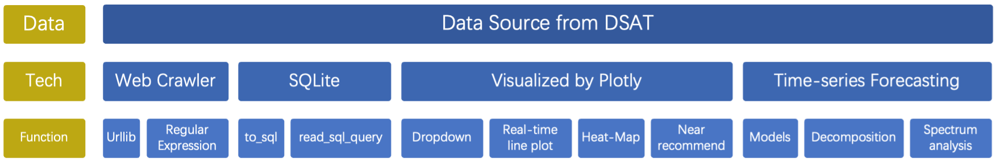
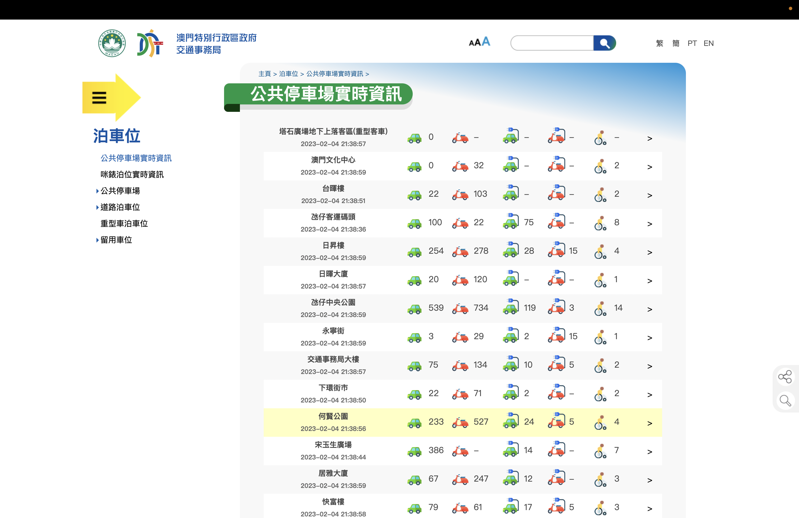
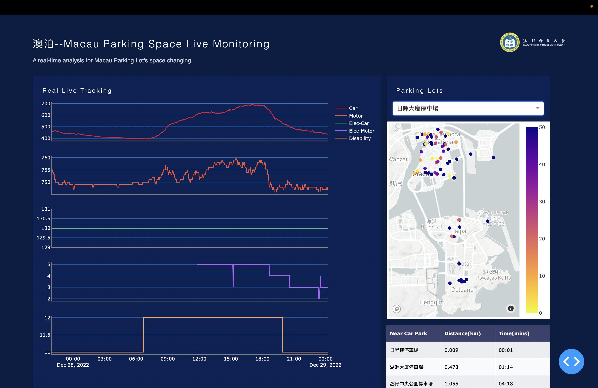
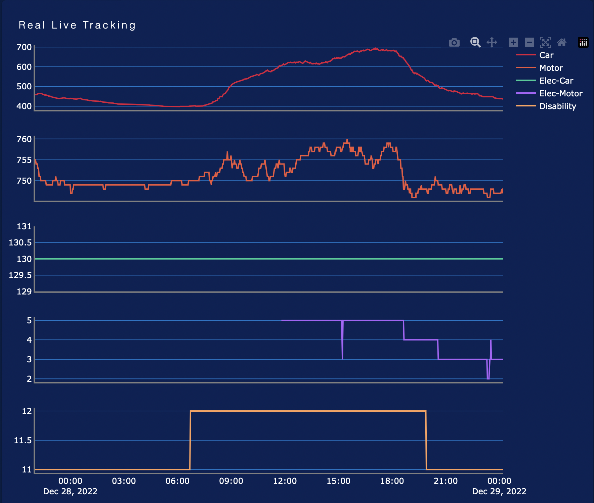
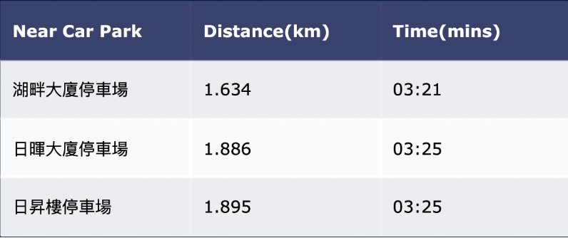
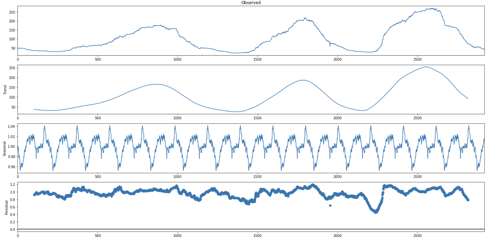
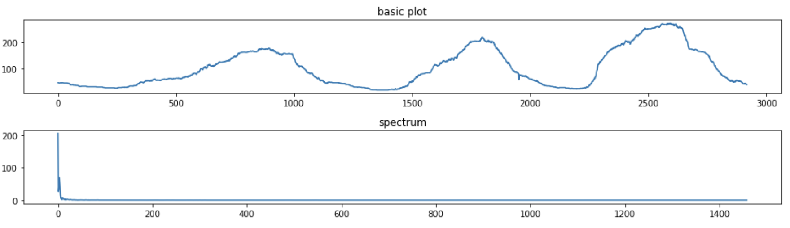
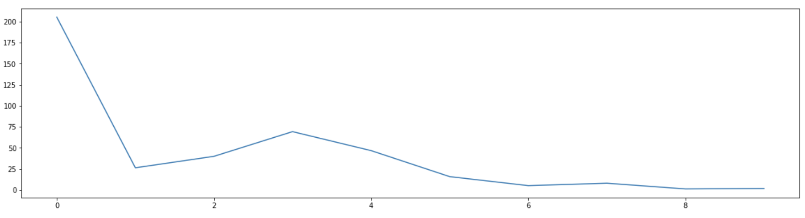

# Parking in Macau: A Real-time Data Dashboard and Forecasting of Parking Space

  Young Chin, Io San Tai, Mingyang Ma

 2220023347 , 2220025580 , 2220019800

Class of E1-2, Master of Applied Mathematics and Data Science,

 Faculty of Innovation and Engineering, Macau University of Science and Technology

Abstract

With the extremly increacing of cars in Macao, public parking lots are in congestion and trouble. This project called *Parking in Macau*, could provide a more intuitive data dashboard with real-time data updating and forecasting. We collect the data from DSAT by web crawler, saved in our database by SQLite. Besides, we visualize these data on the website by *plotly*, including live tracks, dropdown selection, heat-map, and nearby recommendation. In addition, we constructed a forecasting model for parking space using both statistics and time-series models. In the end, some suggestions and solutions were given to improve a better data center for parking lots.

Github:https://github.com/wilsontai34/Macau-Parking-Lots-space-tracking

Video:

## Introduction

### Parking in Macau

When it comes to traffic, people generally think of the dynamic scene of cars running on the road, but urban traffic is more than that. Every car will have a long stopping state, and the combination of stopping and starting is the essence of traffic.As urbanization continues to accelerate, car ownership has been showing rapid growth. By the end of 2021, there will be more than 80 cities in China with a million car owners When there are so many cars in the urban space, people have to face the problem of "where to park the car".

Macau's land area is small and the corresponding parking area is also small. In some popular areas, the number of parking spaces in the area is not enough to accommodate the large number of cars that come in during the rush hours. That is why Macau residents often complain about facing the dilemma of hard to find parking spaces, but there still remain a considerable number of landspaces which hasn't beenc used. Parking difficulties cause a certain degree of traffic congestion, while parking plans are also affected by traffic congestion, which creates a vicious circle.

Nowadays, the website of Macau Transport Bureau updates the data of parking spaces of each parking lot in real time, which helps to relieve the pressure of parking difficulties. However, by looking at the parking lot real-time information interface we will find two obvious problems. First, when users use the interface, they usually only care about the information of one or two parking lots, the design of parking space is not convenient which provides all parking lots information. Second, this table only shows the number of space at recent moment, it doesn't display any trend information and thus cannot tell whether the number of remaining parking spaces is currently increasing or decreasing. This shows that there is still a lot of room for improvement in parking management in Macau.

### Parking in other countries 

The number of parking spaces in the central city of Singapore is quite limited, and at the same time, due to the small size of the country, the construction of parking lots is not suitable for investing too much land resources. The Singapore government developed a public parking application "Parking.sg" in 2017, which allows drivers to select parking spaces and parking duration online by entering their license plate number, enabling integrated management.

Japan, a small and densely populated country, has been making improvements to its parking infrastructure. Almost all parking lots in Japan have parking guidance, real-time information inquiry and self-service payment.
Parking improvements in the U.S. are mostly focused on "space reservations" and now there are new applications using robotic parking. A parking lot in Seattle uses robots in the parking lot to move cars parked in designated areas of the parking lot to the spaces, which saves people's time in parking.

The above three parking management experiences in developed countries show that they all use intelligent technology, both at the management level and in the specific parking process. These intelligent means obviously help to solve the parking problem.

### Our contribution and goal

In this project, we will further optimize the visualization of parking data and combine it with data from other platforms to provide more intuitive and beneficial information to Macau residents. At the same time, we will analyze the existing data to explore the deeper information of different parking lots. Finally, we will use the model and the existing data to effectively predict the future parking data. These efforts will have a great impact on solving the problem of parking difficulties in Macau.

Once the parking difficulty problem is solved, it will not only relieve the parking pressure of residents, but also allow the parking management companies to reduce the cost, relieve the traffic pressure around the parking lots, and help the city planning department to make informed decisions. We therefore believe that solving the parking difficulty problem in Macau is of great value.

## Module and Methods

### Construction

As figure depicts above, we divided the construction of this project into three levels, data level, technical level and function level. Firstly, the data source all project basis on comes from the DSAT official website. We contribute the project by Web Crawler, SQLite, Visualization with Plotly, and Time-series Forecasting. All details of each area will be displayed as follows. Generally, the first three parts are almost the engineering part and the rests are the analysis part, which will be discussed spicificly in chapter 4.

### Web Crawler

Web Crawler is a useful tool to get the data from DSAT. This official website like other website is updating data with time changing every ten seconds. For the content, the figure shows the page of the different kinds of parking lots of each parking space at recent time. Actually, there are five kinds of parking lots(some parking lots maybe only have four or three), and sixty-four public car park in Macao(not included private car park, add three new parking space opening last month). 

Thanks for Urllib (a library which related website application), we can easily get the information of the whole website. One thing deserved to pay attention is that the way of the page update is though sending a package with new update data, so we can catch the package at the moment of page updating. Then, we parse the package, transform it into HTML and catch the useful data by Regular Expression, including the name of parking lot, the update time, the number of left parking space with different types.Because of the updating, we have to make the web crawler work following the path of the frequency of page updating. By doing so, the real-time data can be caught by web crawler automatically.

### Database

Dataset is collected by web crawler every ten seconds and the previous data of vital is important for our analysis work, we should build a database to save these treasure. Fortunately, this data from the website is table form, so it's convenient to save in database using SQLite. The orignal data is all the parking lots' information at one moment. However, from the prospect of client, they prefer to know the condition of their target parking lot, so we create the database with sixty four tables, which contain the changing numbers of their own parking space. Some information of these tables is as table.1.

Two main SQL operations we often used in this project are *to_sql* and *read_sql_query*. The first function is a useful tool for who wanna to write the DataFrame form data into SQL directly. This operation can be considered as the additive operation. However, sometimes we need more SQL operation to process data without in SQL system. Therefore, Python provide the function, which can easily operate the database by sending the SQL commend to *read_sql_query* function.

### Tool of Visulization -- *Plotly*

It's a fantastic tool for visualization, *Plotly* !

After using a series tools of visulization, such as matplotlib, echarts and other traditional tools. *Plotly* really suprised me is that it's fashinable design of graphs and clear construction of code. Except traditional plots, it provides some operation kits with less code. Actually, there are three mudules of general project in *plotly*, which are component, graph and callback. Component is the part that could make an interaction with client. Graph is the part which presents the plots to the client. What set up the bridge between component and graph is the callback module, which contains the relationship between these two modules. This partten is similar to the Django framework, called MTV(Module, Template and View).

*Plotly* also offers us a easy way to set your visualization on website. It's more convenient for client without too much files. Just an url could show you a wonderful dashboard with real-time changing data of parking.

## Visualization

Public parking lots are handled by DSAT (Transport Bureau of the Macao S.A.R.). For the convenience of the public, DSAT will update the traffic information on their official website, citizen can check traffic information like real-time parking information though the official website. In Macau, there are 64 parking lots for public (not included private owned). However, it is hard to know which parking lot is available for parking or some advanced information in a short time. 

Hence, we have designed a visualization webpage for our user tracking space changing of every public car park per day. For well user experience, we separate four different components: 

### Real-time changing with Line Plot

The plot presents trend of space at every parking lots. In this section, tracking table is organized by five subplots. Each of them represents different space of their categories, which is Cars, Motor, Electricity Car, Electricity Motor and Disability Person’s Car.

Subplots display space changing of every category around 24 hours. They can provide history data for user to estimate space and schedule daily plan. Besides, the plot updates time is 5 seconds. 

There are 63 public parking lots in Macau, which means it’s not proper to display all information in one single page. Thus, a drop bar is designed for selecting which parking lot they are interest, then tracking table and recommend table will be updated to the selected parking lot.

### Parking Condition with Heat-map

Heat Map provide a full picture of Macau S.A.R with tags of public parking lot. The color marks are designed to help user quickly know which parking lots is available for parking. When user moves the mouse to any tags, the information about that parking lots will pop up including name, location, space, and coordinate.

<figure>

  
   

### Near Recommendation

Every city has the same traffic problem, that’s popular area. With more people on same area, the possibility of traffic jam will be higher. To solve this problem, it cannot only show how many spaces is left in every car park, guiding them to other nearest car park seems to be a solution. Therefore, near parking lots is built for finding other available car park if the one you are looking for is full. It propose an alternative way for making a right, fast and comfort travel experience instead of waiting a long time for a space.

Making recommendation to users automatically is no longer a rare thing. In this project, we make a *recommend module* based on the driving distance between different locations of parking space and the real-time situation of parking pace.

To be honest, calculating the distance of each location through its longtitude and latitude is unsuitable and useless. Therefore, we find other way to caculate the distance of each location, the route API from amap(aka Gaode Map). 

- Get the key from the official website of Gaode.
- Send the request with location and get the html with distance
- Circulate last step to get all the distance of each parking space

We saved all these distance between origin and destination of all paking space. By doing so, we built a table, which we can match the input parking space with origin to get the distance with other paking space. 

## Forecasting

### Forecasting Based on statistics

In this part we will classify Macau parking lots by function. At the same time, the number of parking spaces in the short term can be predicted by combining past data with calculations. We hope that these results can assist Macau residents in making parking decisions and contribute to the development of Macau's transportation.

We captured data from 60 parking lots in Macau between December 26th, 2022 to December 28th, 2022, with a frequency of about 1 time/2 minutes. The data captured includes the remaining spaces for cars, motorcycles, electric vehicles and other vehicle types in different parking lots at different moments in time. Considering that all parking lots are set up with car parking spaces, and the problem of difficult parking generally occurs in the type of cars. Therefore, only the car data were statistically analyzed here.

In this part we will classify Macau parking lots by function. At the same time, the number of parking spaces in the short term can be predicted by combining past data with calculations.

We captured data from 60 parking lots in Macau between December 26th, 2022 to December 28th, 2022, with a frequency of about 1 time/2 minutes. The data captured includes the remaining spaces for cars, motorcycles, electric vehicles and other vehicle types in different parking lots at different moments in time. 

Considering that all parking lots are set up with car parking spaces, and the problem of difficult parking generally occurs in the type of cars. Therefore, only the car data were statistically analyzed here.

#### Parking function division

The data from 60 parking lots were first processed. We found that the 2nd, 11th, 20th, and 28th of these parking lots have a large amount of missing data in the limited time period, so they are not considered.

Since the data of parking lots generally change within a one-day cycle, the data of these three days were selected separately for plotting. After plotting, it is found that there are two obvious trends in the single-day data fluctuations of the parking lots: the remaining parking spaces of the 25th parking lots, such as the 8th, 9th and 10th, show a "U" shape with more spaces in the morning and evening and less spaces at noon; the opposite is true for the 18th parking lots, such as the 3rd, 4th and 5th, which show an "inverted U" shape. In addition, the remaining parking spaces in the 43rd and 47th parking lots have a "W" shape; the remaining parking spaces in the 48th and 49th parking lots are huge and almost constant. The rest of the parking lots have irregular variations, while these parking lots are characterized by a small number of parking spaces.Combine with people's daily routine, we believe that the parking lots around the working areas have a "U" shape, and the parking lots around the residential areas have an "inverted U" shape. Therefore, it can be concluded that there are currently 18 parking lots in Macau mainly serving the parking needs of residents in the surrounding residential areas, and 25 parking lots mainly serving the commuting and business parking needs of the surrounding office areas.

Next we counted the times when there were the least and most parking spaces (in hours) in these parking lots using the data from 26 to 28 days, and plotted the following scatter plot. The blue dots indicate the time with the least number of parking spaces in the different parking lots, and the red dots indicate the time with the most number of parking spaces in the different parking lots.

From the graph, we can find that the distribution of the least time is relatively scattered, mostly between 0:00 and 15:00, while the time with the highest number of parking spaces is mainly concentrated in the period from 15:00 to 0:00. 

In addition according to the maximum number scatter plot with coordinates, one can learn the time when the maximum number of parking spaces is available in different parking lots. 

Since there is an obvious regularity in the change of parking spaces in these parking lots, this plot can help residents to choose other parking lots when there is no space in the selected parking spot.

#### Forecasted number of Parking spaces

In this part we want to build a simple prediction model for the number of parking spaces manually using the existing data. For the same parking lot, when the number of parking spaces at the current moment is known, the number can be combined with the trend of parking space change on the same moment on different dates with the same trend to achieve the purpose of predicting the number of parking spaces in the short time period in the future.  The model expression is：

Y2 = Y1 + (X2 - X1),
  
where Y2 represents the number of parking spaces at the moment we want to predict, Y1 represents the number of current parking spaces, X2 represents the number of parking spaces at the moment we want to predict at the same moment in history, and X1 represents the number of parking spaces at the current moment at the same moment in history. Using the existing data, the data of the 26th and 27th days can be used as X, and the data of the 28th day can be used as Y. As an example, suppose the number of parking spaces in parking lot 3 is known at 12:00 on the 28th, and we wish to predict the number of parking spaces in that parking lot two hours later. We will take the difference of the number of parking spaces in the same time period on 26 and 27 respectively, sum them up and take the average, and then add them with the number of parking spaces at 12:00 on the 28th to get the predicted number of parking spaces.

Through this model, residents can know the number of parking spaces in the parking lot at the future moment in advance. This feature will help residents to make better planning for their trips. 

#### Chapter Summary

Through the statistical analysis in this chapter, we classify Macau parking lots mainly into those around residential areas and those around work areas. Combined with this result, Macau residents can stagger their parking choices in the parking lots. After counting the moments of the maximum remaining parking spaces, we found that the maximum remaining parking spaces are mainly concentrated between 15:00 and 0:00. People can combine the scatter plot of the maximum remaining parking spaces to make parking lot selection. Finally, using the existing data, a simple parking space prediction model is established. When the data is steadily crawled for a long time, the prediction results will help Macau residents to predict the number of parking spaces in any parking lot in the future in advance, which provides convenience for their life.

### Forecasting Based on Time Series

Due to the different location of these all sixty four parking lots, we have selected a few parking lots with good view of the data plotted on the graph. Cause the left parking space is crawled with time, it's suitable to use time series model to make the forecasting. 

Firstly, we make pre-processing of the data. Here we did a caculation of log with the data. Then, in the model part, we select a series of time-series models, including SimpleExpSmoothing, ARIMA, SARIMAX, and Auto-ARIMA. To make the performance of time-series forecsting clearly, we plot the fitted data and the result of forecasting as the figure shows. As we can see from the picture, the model didn't show perfect result but acceptable shape.

To make a deeper step, we try to make a decomposition of time series as figure x. The result of decomposition shows us that it departs the seasonal, but the trend is still contain some seasonal.

Therefore, we want to optimize the performance by selecting suitable frequency, which is the key parameter of ARIMA model. We know that the frenquency of the time series could be closed to the flat node. We can see the whole spectrum plot reduced quickly at first. After extracting the first ten points, we can find that the second point is the flat node. Its value that about 25 is considered as the frequency of our time series model.

Unfortunately, after we try a few methods, it still didn't show us a good result we think. Although, the model made a good simulation to the original data, the prediction is not good enough to be presented. We guess the possible reasons and solutions are as follows.

- The time series is too short to have a stong seasonal. We are tring to crawl more data to make a better performance comes true.
- The data is complicated due to the particular period in Macao. This makes the data couldn't present a good appearance. It's better to collect more regular data with less influence by spacial issues.
- The traditional time-series models didn't make much effects on the data. More powerful models should be tried facing the problems above. Maybe we can try to design some feature of time and turn it into a machine learnig question.

## Conclusion

Parking in Macau is a real-time data visualization and prediction system for local parking lots in Macao. We collect the information and data from DSAT by web crawler, saving in our database by SQLite. The excellent tool for visualization made us build a data dashboard with live tracks, dropdown selection, heat-map, and nearby recommendation. For the forecasting part, both statistics model and time-series model were used to give more helpful suggestions for people parking. Although, it didn't show a great prediction, we believe that it can be improved by our solutions in the future. So many thoughts haven't be achieved because of the limitation of  time, data and technology, such as the intergration of parking lots' systems and the traffic condition of roads, data center of parking lots with more data and suitable models for forecasting.

This project is the final project of Open Source Tools for Data Science supervised by Prof. Lu. We have learn a lot from this course with the theaching of Prof. Lu. What really impress us is that not only the knowledge from basic Programming by python to regular machine learning with theory and practice, but also the the skills of study and thoughts of life. Hope we could learning more from you in the future. Thanks you!

